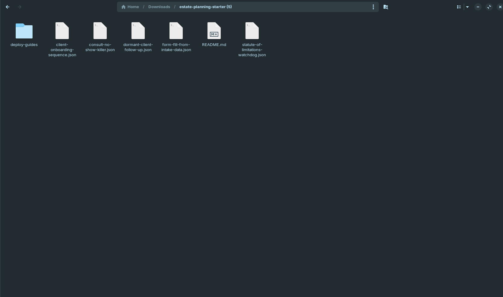
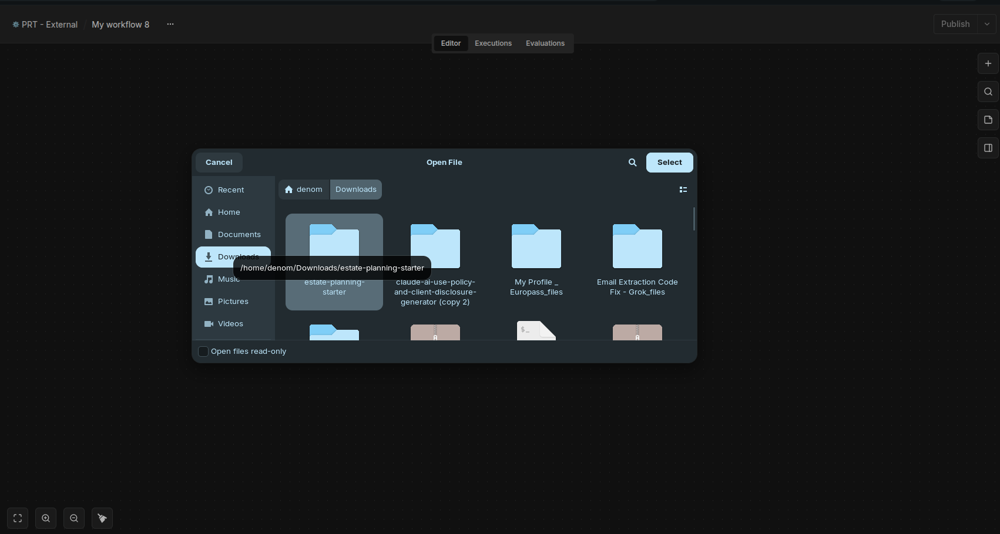
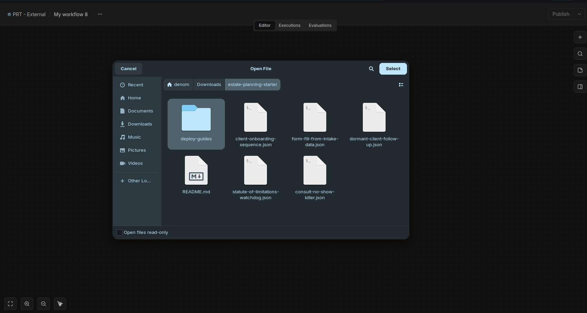
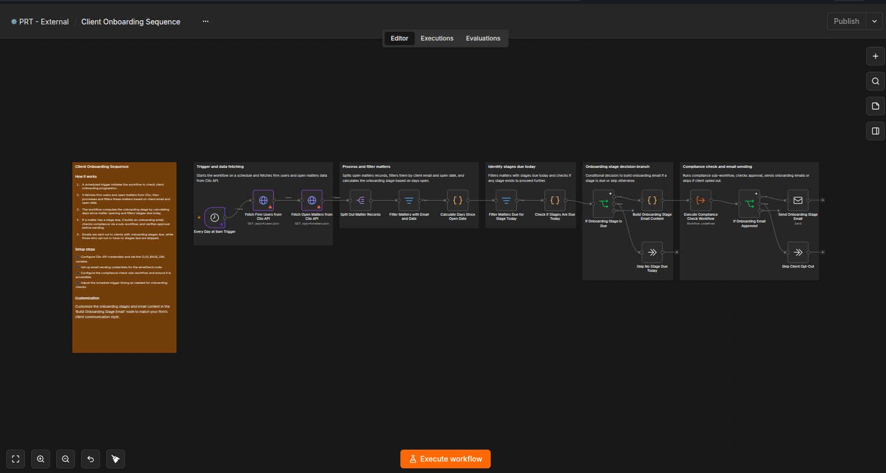

# The Estate Planning Firm Starter Pack

Five free n8n automations built specifically for estate planning firms — no missed consults, no re-typed intake forms, no clients going quiet after signing, no missed filing deadlines, and no plan left to go stale for years without anyone noticing.

## The problem this solves

Estate planning firms lose time and revenue in the same five places, over and over:

- A prospective client books a consult, forgets about it, and never reschedules — a lost engagement that never even makes it onto anyone's radar.
- A paralegal retypes the same names, dates, and family details from an intake form into a will or trust template by hand, every single time.
- A new client signs, then goes quiet for weeks with no idea what happens next — and starts wondering if they made the right choice.
- A filing or review deadline gets flagged once, then buried under everything else on someone's desk until it's nearly too late.
- A client's estate plan sits untouched for years after a marriage, a birth, a move, or a change in the tax law — because nobody's job is to notice.

This free bundle installs in an afternoon and addresses all five, without adding a single new paid subscription.

## What's included

1. **Consult No-Show Killer** (`consult-no-show-killer.json`) — The moment someone books a consultation, this confirms it instantly, then sends two timed reminders by text and email as the appointment approaches. If they can't make it, an easy reschedule link is right there in the reminder — so a forgotten consult becomes a rescheduled one instead of a lost lead.
2. **Wills & Trusts Intake Auto-Fill** (`form-fill-from-intake-data.json`) — Takes what a client already typed into your intake form and turns it into a ready-to-review draft of your firm's own template — the retainer, plus whatever other document types you build on top of it. Nobody on your team retypes a name, a date of birth, or a beneficiary's address that the client already gave you.
3. **Client Onboarding Sequence** (`client-onboarding-sequence.json`) — A structured welcome journey that runs automatically after a client signs: sets expectations for what happens next, explains the process in plain language, and keeps new estate planning clients informed through the first weeks of their matter — without anyone on staff having to remember to send a single email.
4. **Estate & Probate Deadline Watchdog** (`statute-of-limitations-watchdog.json`) — Escalates every filing and review deadline your team has flagged, on a 180/90/30-day-then-daily schedule as the date gets closer. A deadline that would otherwise sit quietly on a calendar gets progressively louder the closer it gets, so nothing slips past unnoticed.
5. **"Time to Review Your Plan" Alerts** (`dormant-client-follow-up.json`) — Flags past clients to your team the moment it's been a while since their estate plan was last reviewed, so an attorney can reach out proactively — before a life change makes an old plan obsolete, and before the relationship goes cold.

Together, these five workflows replace the patchwork of scheduling tools, document-assembly subscriptions, and manual follow-up spreadsheets that many estate planning firms cobble together by hand — recovering hours of paralegal and front-desk time every week.

## How to import and use these workflows

Each workflow in this pack is a separate, independent `.json` file — install one, some, or all five, in any order. Here's exactly what that looks like, start to finish.

### Step 1 — Unzip the download

After downloading, unzip the file. You'll see one `.json` file per workflow, a `deploy-guides/` folder (one detailed setup guide per workflow, matching filenames), and this README.

### Step 2 — Open the import menu in n8n

Open your n8n instance, create a new blank workflow, click the **`⋯`** menu in the top bar, then **Import → Import from file...**.

### Step 3 — Browse to the unzipped folder

In the file picker, navigate to wherever you unzipped the pack.

### Step 4 — Select the workflow you want to import

Pick the `.json` file for the automation you want to set up first — for example, `client-onboarding-sequence.json`.

### Step 5 — Confirm the import

The workflow appears fully built on your canvas, including its own built-in setup guide (the orange sticky note in the top-left) — condensed instructions right where you're working, so you don't have to keep switching back to this README.

### Step 6 — Add credentials and set variables

Every workflow needs its own credentials (e.g. your email account, your Clio account) and a handful of n8n Variables (e.g. your firm's name, which email address things get sent from). The exact list is different for each workflow — follow that workflow's own setup guide in the `deploy-guides/` folder (same filename, `.md` instead of `.json`) for the specific credentials and variables it needs, step by step.

### Step 7 — Test before going live

Every workflow ships turned off (**Active** toggled off), with realistic sample test data already loaded on its trigger node. Run it through with that sample data first and confirm it behaves the way you expect — nothing here touches a real client until you're ready and have switched it on yourself.

### Step 8 — Activate

Once you've confirmed it, toggle the workflow to **Active** in the top-right corner, and repeat Steps 2–7 for any of the other four workflows you want to set up.

## Compliance

Every automation in this pack is operational only — scheduling, field population, routing, and reminders. None of them draft legal language, interpret a client's situation, or exercise legal judgment on your behalf (per ABA Opinion 512). Every generated document and every client-facing message still requires a human review step before it goes out.

## Want more?

Want these tuned specifically to your firm's templates, intake forms, and review cadence — plus ongoing support? [Book a call with Protomated](https://protomated.com/book).
