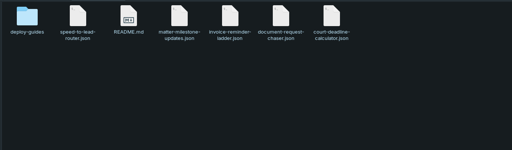
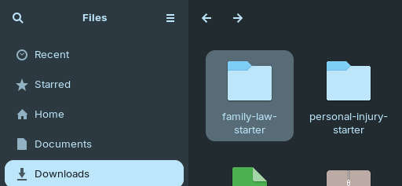
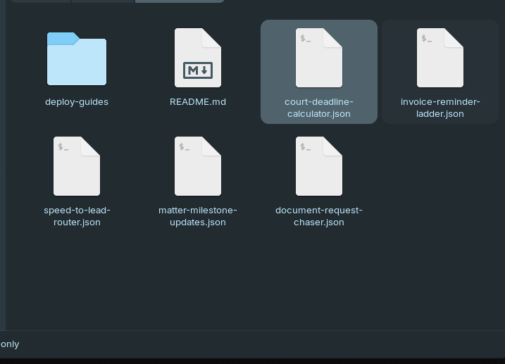
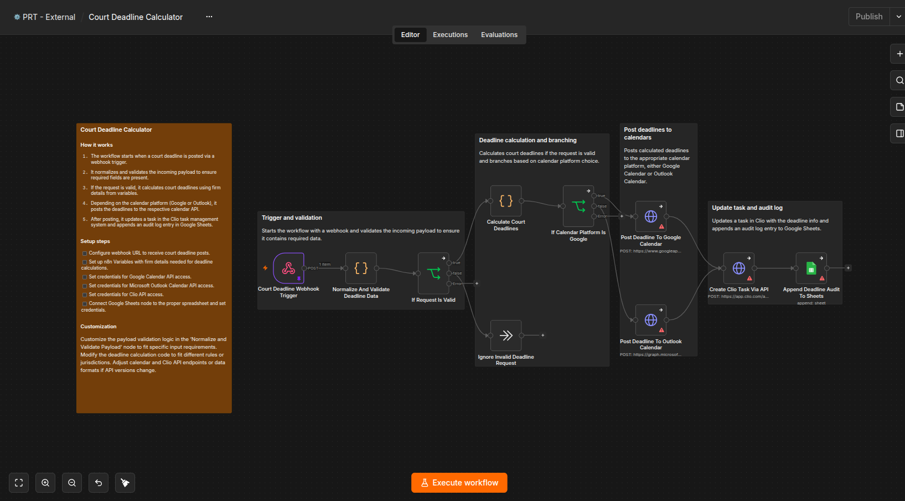

# The Family Law Firm Starter Pack

Five free n8n automations for the parts of family law that eat staff time — slow lead response, anxious clients calling for status updates, missing discovery documents, unpaid invoices, and court deadlines that can't be missed.

## The problem this solves

Family law clients are often going through the hardest period of their life, and that means more calls, more anxiety, and more paperwork than almost any other practice area:

- A new inquiry comes in and sits unanswered for hours while staff handle everything else — and a prospective client in a difficult situation calls the next firm instead of waiting.
- A matter reaches a real milestone, but nobody tells the client, so they call in "just checking" — a call that costs staff time and could have been prevented with a two-line update.
- Financial disclosures or discovery documents get requested once and then nobody follows up, so paralegals end up manually tracking who still owes what.
- An invoice goes unpaid because nobody has a structured process for following up, so collections quietly slides.
- A court deadline gets flagged once and then buried, until it's nearly (or actually) too late.

This free bundle responds to new leads before they call a competitor, keeps clients informed without a phone call, chases outstanding documents automatically, keeps invoices from going stale, and never lets a court deadline slip.

## What's included

1. **Speed-to-Lead Router** (`speed-to-lead-router.json`) — Routes and responds to new inquiries the moment they arrive, so a prospective client going through a difficult situation isn't left waiting on a callback.
2. **Matter Milestone Updates** (`matter-milestone-updates.json`) — Proactively lets clients know the moment their matter reaches a key milestone, cutting down the "just checking in" calls that consume staff time.
3. **Document Request Chaser** (`document-request-chaser.json`) — Automatically follows up with clients who haven't submitted requested financial disclosures or discovery documents, so paralegals aren't manually tracking a checklist by hand.
4. **Invoice Reminder & Collections Ladder** (`invoice-reminder-ladder.json`) — A structured, increasingly direct reminder sequence for unpaid invoices, so collections doesn't rely on someone remembering to follow up.
5. **Court Deadline Calculator** (`court-deadline-calculator.json`) — Calculates every downstream court deadline from a matter's key dates and drops each one into your calendar and task list automatically.

Together, these five workflows replace a patchwork of CRM lead-routing tools, manual status-update calls, paralegal document-chasing spreadsheets, and collections follow-up — recovering hours of staff time every week during what is often the most demanding client communication in the practice.

## How to import and use these workflows

Each workflow in this pack is a separate, independent `.json` file — install one, some, or all five, in any order. Here's exactly what that looks like, start to finish.

### Step 1 — Unzip the download

After downloading, unzip the file. You'll see one `.json` file per workflow, a `deploy-guides/` folder (one detailed setup guide per workflow, matching filenames), and this README.

### Step 2 — Open the import menu in n8n

Open your n8n instance, create a new blank workflow, click the **`⋯`** menu in the top bar, then **Import → Import from file...**.

### Step 3 — Browse to the unzipped folder

In the file picker, navigate to wherever you unzipped the pack.

### Step 4 — Select the workflow you want to import

Pick the `.json` file for the automation you want to set up first — for example, `court-deadline-calculator.json`.

### Step 5 — Confirm the import

The workflow appears fully built on your canvas, including its own built-in setup guide (the orange sticky note in the top-left) — condensed instructions right where you're working, so you don't have to keep switching back to this README.

### Step 6 — Add credentials and set variables

Every workflow needs its own credentials (e.g. your email account, your Clio account) and a handful of n8n Variables (e.g. your firm's name, which email address things get sent from). The exact list is different for each workflow — follow that workflow's own setup guide in the `deploy-guides/` folder (same filename, `.md` instead of `.json`) for the specific credentials and variables it needs, step by step.

### Step 7 — Test before going live

Every workflow ships turned off (**Active** toggled off), with realistic sample test data already loaded on its trigger node. Run it through with that sample data first and confirm it behaves the way you expect — nothing here touches a real client until you're ready and have switched it on yourself.

### Step 8 — Activate

Once you've confirmed it, toggle the workflow to **Active** in the top-right corner, and repeat Steps 2–7 for any of the other four workflows you want to set up.

## Compliance

Every automation in this pack is operational only — routing, status updates, document reminders, billing reminders, and deadline calculation from firm-entered rules. None of them give legal advice, predict case outcomes, or exercise legal judgment on your behalf (per ABA Opinion 512).

## Want more?

Want these tuned to your firm's specific matter types, document checklists, and collections policy — plus ongoing support? [Book a call with Protomated](https://protomated.com/book).
