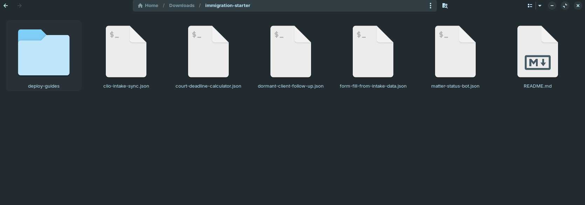
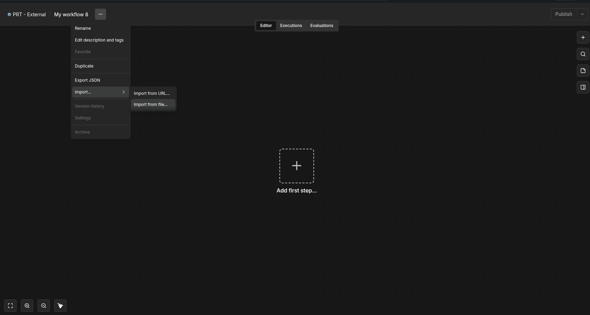
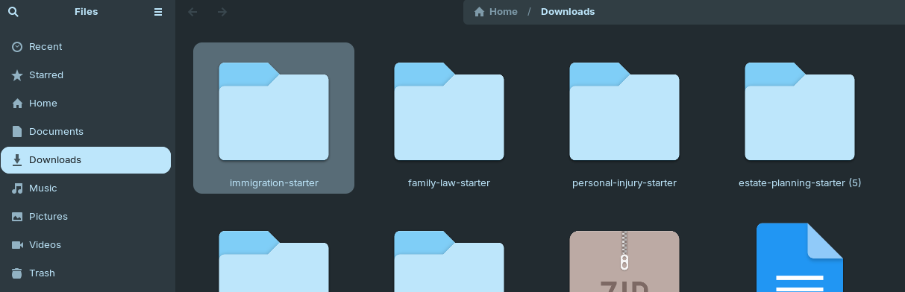
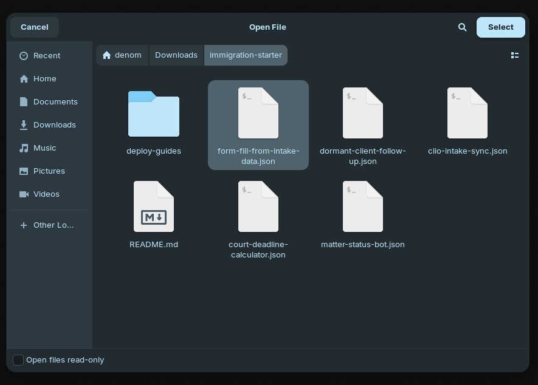
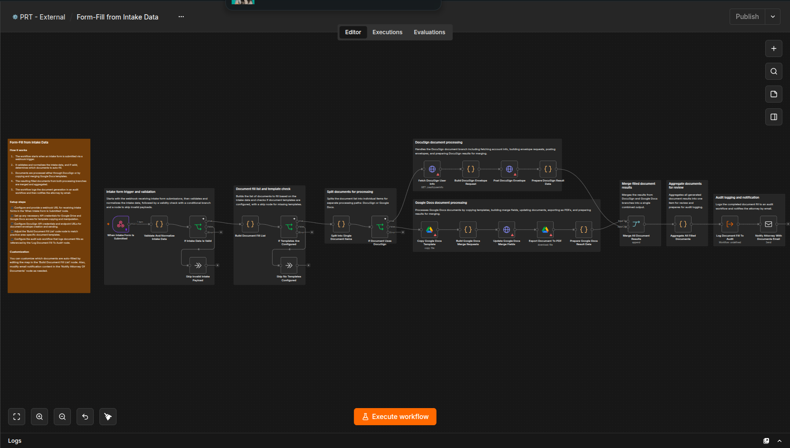

# The Immigration Firm Starter Pack

Five free n8n automations for the parts of immigration practice that generate the most calls and the most paperwork — new intake, filing deadlines, renewal reminders, case-status questions, and form population.

## The problem this solves

Immigration clients call more than clients in almost any other practice area, because USCIS timelines are opaque and the stakes are high:

- A prospective client fills out your website intake form, and someone on staff has to manually copy those same details into your practice management system.
- A filing or response deadline gets set once and then has to be tracked by hand across dozens of open cases.
- A client's status is coming up for renewal, but nothing flags it until the client calls in a panic near the deadline.
- The phone rings constantly with "what's the status of my case" questions that pull an attorney away from actual casework.
- The same names, dates, and details a client already gave you at intake get retyped by hand into every form your firm uses.

This free bundle gets new intake into your practice management system without retyping, tracks every RFE and appeal deadline automatically, flags your team when a client's status is coming up for renewal, answers routine status questions without an attorney interruption, and fills your firm's own forms from intake data.

## What's included

1. **Intake Form to PM Contact** (`clio-intake-sync.json`) — The moment a prospective client submits your website intake form, this writes a clean Contact and Matter into your practice management system automatically — no staff member has to retype it.
2. **Filing & Response Deadline Tracker** (`court-deadline-calculator.json`) — Calculates every downstream deadline — RFE responses, appeal windows, filing dates — from the dates your attorneys define, and drops each one into your calendar and task list.
3. **Renewal Alerts** (`dormant-client-follow-up.json`) — Flags past clients to your team when their status is coming up for renewal, so someone reaches out well before a lapse becomes urgent.
4. **Matter Status Bot** (`matter-status-bot.json`) — Answers routine "what's the status of my case" questions by text or email, straight from your practice management system's own data — no attorney interruption needed.
5. **Form-Fill from Intake Data** (`form-fill-from-intake-data.json`) — Fills your firm's own form templates with the client's intake details — no more retyping the same names, dates, and details into multiple documents.

Together, these five workflows replace a patchwork of manual data entry, spreadsheet-based deadline tracking, and constant phone-based status updates — recovering hours of staff time every week in a practice area where client anxiety and call volume run especially high.

## How to import and use these workflows

Each workflow in this pack is a separate, independent `.json` file — install one, some, or all five, in any order. Here's exactly what that looks like, start to finish.

### Step 1 — Unzip the download

After downloading, unzip the file. You'll see one `.json` file per workflow, a `deploy-guides/` folder (one detailed setup guide per workflow, matching filenames), and this README.

### Step 2 — Open the import menu in n8n

Open your n8n instance, create a new blank workflow, click the **`⋯`** menu in the top bar, then **Import → Import from file...**.

### Step 3 — Browse to the unzipped folder

In the file picker, navigate to wherever you unzipped the pack.

### Step 4 — Select the workflow you want to import

Pick the `.json` file for the automation you want to set up first — for example, `form-fill-from-intake-data.json`.

### Step 5 — Confirm the import

The workflow appears fully built on your canvas, including its own built-in setup guide (the orange sticky note in the top-left) — condensed instructions right where you're working, so you don't have to keep switching back to this README.

### Step 6 — Add credentials and set variables

Every workflow needs its own credentials (e.g. your Clio account, your email account) and a handful of n8n Variables (e.g. your firm's name, which email address things get sent from). The exact list is different for each workflow — follow that workflow's own setup guide in the `deploy-guides/` folder (same filename, `.md` instead of `.json`) for the specific credentials and variables it needs, step by step.

### Step 7 — Test before going live

Every workflow ships turned off (**Active** toggled off), with realistic sample test data already loaded on its trigger node. Run it through with that sample data first and confirm it behaves the way you expect — nothing here touches a real client until you're ready and have switched it on yourself.

### Step 8 — Activate

Once you've confirmed it, toggle the workflow to **Active** in the top-right corner, and repeat Steps 2–7 for any of the other four workflows you want to set up.

## Compliance

Every automation in this pack is operational only — data entry, deadline calculation from firm-entered rules, reminders, status reporting, and field population. None of them give immigration advice, predict case outcomes, or exercise legal judgment on your behalf (per ABA Opinion 512).

## Want more?

Want these tuned to your firm's specific case types, USCIS form set, and renewal cadence? [Book a call with Protomated](https://protomated.com/book).
