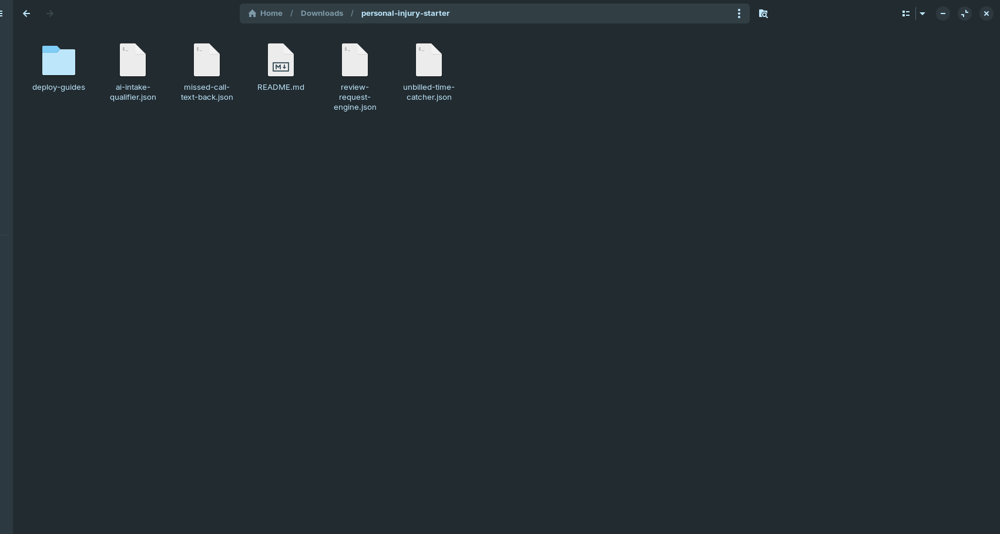
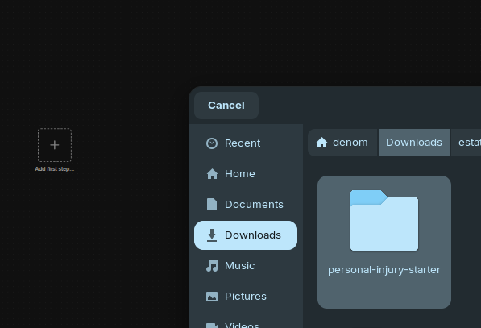
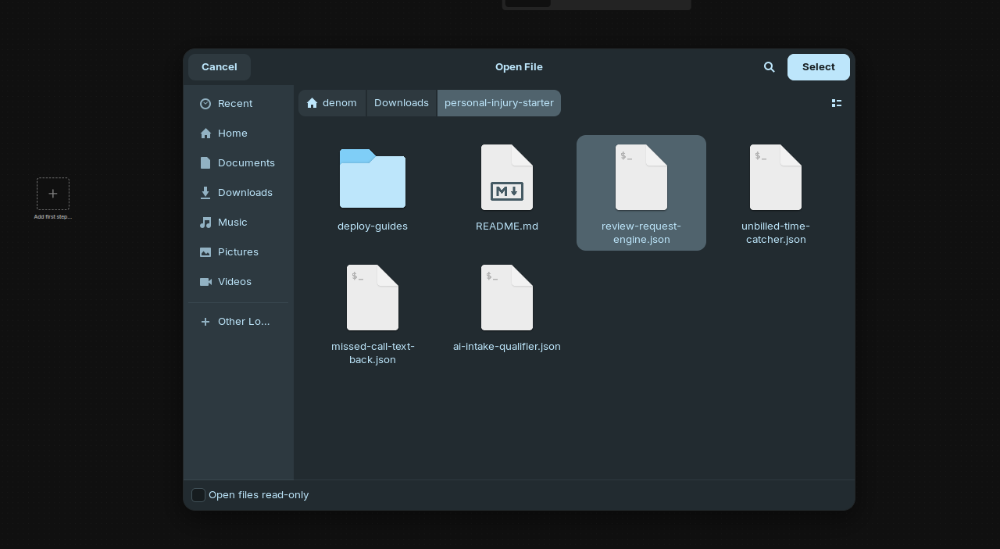
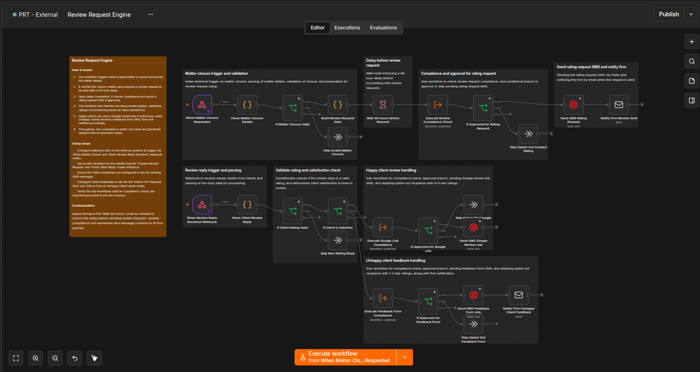

# The Personal Injury Firm Starter Pack

Four free n8n automations built for how PI firms actually lose leads and revenue — missed calls, unqualified intake eating attorney time, untracked billable minutes, and settlements that end without a review request.

## The problem this solves

Personal injury intake moves fast, and every missed call is a call to the next firm:

- A call comes in after hours or while staff are on another line, and by the time anyone calls back, that prospective client has already called someone else.
- An attorney's time gets eaten by inquiries that were never a real fit — tire-kickers, out-of-area cases, matters outside your practice areas — before anyone screens them out.
- A quick client check-in call happens informally, never gets logged as billable time, and quietly disappears before the invoice goes out.
- A case closes well, everyone's relieved, and nobody remembers to ask for a review while the client's still happy — or worse, an unhappy client gets asked and lands a bad review on your public profile.

This free bundle catches the calls you miss, filters serious inquiries from tire-kickers before an attorney ever sees them, recovers the billable time that slips through informal client check-ins, and asks for a review the moment a case closes well — with built-in gating so only satisfied clients are ever asked publicly.

## What's included

1. **Missed-Call Instant Text-Back** (`missed-call-text-back.json`) — The moment your firm misses a call, the caller instantly receives a text letting them know you'll be in touch, and your team gets an email alert — so a missed call becomes a warm follow-up instead of a lead who's already dialing the next firm.
2. **AI Intake Qualifier** (`ai-intake-qualifier.json`) — Scores every new inquiry against your firm's own practice areas and urgency signals, replies appropriately based on fit, and immediately alerts an attorney for the highest-fit leads — so attorney time goes to real cases, not screening calls.
3. **Unbilled-Time Catcher** (`unbilled-time-catcher.json`) — Cross-references your calendar against logged time entries so client calls and case-status check-ins that never made it onto an invoice get caught and flagged before the bill goes out, instead of quietly writing off billable time.
4. **Review Request Engine** (`review-request-engine.json`) — Automatically requests a review from clients after a matter closes well, with built-in rating-gating so a client who indicates they're unhappy is never funneled toward your public Google profile in the first place.

Together, these four workflows replace a patchwork of answering services, intake-screening subscriptions, and manual billing review — recovering both the leads that would have gone to a competitor and the billable hours that quietly disappear in a high-volume PI practice.

## How to import and use these workflows

Each workflow in this pack is a separate, independent `.json` file — install one, some, or all four, in any order. Here's exactly what that looks like, start to finish.

### Step 1 — Unzip the download

After downloading, unzip the file. You'll see one `.json` file per workflow, a `deploy-guides/` folder (one detailed setup guide per workflow, matching filenames), and this README.

### Step 2 — Open the import menu in n8n

Open your n8n instance, create a new blank workflow, click the **`⋯`** menu in the top bar, then **Import → Import from file...**.

### Step 3 — Browse to the unzipped folder

In the file picker, navigate to wherever you unzipped the pack.

### Step 4 — Select the workflow you want to import

Pick the `.json` file for the automation you want to set up first — for example, `review-request-engine.json`.

### Step 5 — Confirm the import

The workflow appears fully built on your canvas, including its own built-in setup guide (the orange sticky note in the top-left) — condensed instructions right where you're working, so you don't have to keep switching back to this README.

### Step 6 — Add credentials and set variables

Every workflow needs its own credentials (e.g. your Twilio account, your email account) and a handful of n8n Variables (e.g. your firm's name, which email address things get sent from). The exact list is different for each workflow — follow that workflow's own setup guide in the `deploy-guides/` folder (same filename, `.md` instead of `.json`) for the specific credentials and variables it needs, step by step.

### Step 7 — Test before going live

Every workflow ships turned off (**Active** toggled off), with realistic sample test data already loaded on its trigger node. Run it through with that sample data first and confirm it behaves the way you expect — nothing here touches a real client until you're ready and have switched it on yourself.

### Step 8 — Activate

Once you've confirmed it, toggle the workflow to **Active** in the top-right corner, and repeat Steps 2–7 for any of the other three workflows you want to set up.

## Compliance

Every automation in this pack is operational only — routing, scoring by firm-configured rules, time-entry cross-referencing, and review requests. None of them evaluate case merits, give a legal opinion on a claim, or exercise legal judgment on your behalf (per ABA Opinion 512).

## Want more?

Want deeper AI-based intake scoring, PM systems beyond Clio, or authentication options for sensitive matters? [Book a call with Protomated](https://protomated.com/book).
